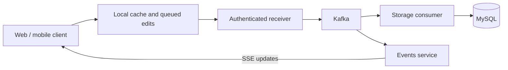

<p align="center">
  <a href="https://pokegonexus.com">
    
  </a>
</p>

# Pokémon Go Nexus

**Your collection. Your community. Your next trade.**

Pokémon Go Nexus is a Pokémon GO collection and trade platform for web and
mobile. Track Pokémon and their variants, discover trainers nearby, plan trades,
and explore raid, PvP, and Max Battle tools. Collection edits use local caching
and queued sync, with live updates connecting clients and backend services.

[Open Nexus](https://pokegonexus.com) · [Frontend guide](frontend/README.md) ·
[Android beta](frontend/apps/mobile/ANDROID_BETA.md) ·
[GitHub Actions](https://github.com/AdamWentworth/PokeGoNexus/actions)


[](LICENSE)

## Tech stack


| Layer | Technologies |
| --- | --- |
| Web | React 19, TypeScript 6, Vite 8, Zustand, IndexedDB, OpenLayers |
| Mobile | Expo, React Native, Expo Router, SQLite, shared contracts and domain packages |
| Authentication | Node.js 24, Express, MongoDB, JWT and per-device sessions |
| Pokémon catalog | Go, `net/http`, chi, PostgreSQL, in-process and optional Redis caching |
| Discovery and location | Go, MySQL, PostgreSQL/PostGIS |
| Collection and trade sync | Go, Kafka, MySQL, Server-Sent Events |
| Catalog authoring | Python, Tkinter, PostgreSQL |
| Delivery and quality | Docker, NGINX, GitHub Actions, Vitest, Jest, Playwright, Go tests |

## What you can do

- **Manage a collection:** caught, trade, and wanted lists; tags; owned instances;
  shiny, costume, background, regional, Mega, fusion, and other variant details.
- **Find trainers and trades:** public collections, location-aware search, map
  results, trade proposals, status tracking, and shareable Trade Boards.
- **Plan battles:** raid attacker rankings, PvP analysis, and Max Battle tools
  with documented [raid](docs/raid-ranking-methodology.md) and
  [PvP](https://pokegonexus.com/pvp/methodology) methodologies.
- **Keep collection state available:** IndexedDB on web and SQLite in the native
  preview support local recovery and queued collection edits. Trade commands
  remain online and server-authoritative.

The platform is under active development. The mobile workspace includes a
WebView restore point and native preview workflows; see the
[mobile guide](frontend/apps/mobile/README.md) for current rollout details.

## Repository map

| Path | Responsibility |
| --- | --- |
| [frontend/](frontend/README.md) | Web/mobile workspaces and shared packages |
| [frontend/packages/app-core/](frontend/packages/app-core/README.md) | Canonical web source, routes, components, stores, and tests |
| [authentication/](authentication/README.md) | Accounts, authentication, and sessions |
| [pokemon/](pokemon/README.md) | Go Pokémon API and PostgreSQL reference catalog |
| [location/](location/README.md) | Geocoding, reverse lookup, and autocomplete with PostGIS |
| [reader/](reader/) | [Search](reader/search/README.md), [users](reader/users/README.md), and [events/SSE](reader/events/README.md) services |
| [receiver/](receiver/README.md) | Authenticated client-update ingestion into Kafka |
| [storage/](storage/README.md) | Kafka consumers and MySQL persistence |
| [editor/](editor/README.md) | Python catalog authoring tools |
| [assets/](assets/) | Shared media served under `/media/` |
| [kafka/](kafka/README.md), [nginx/](nginx/), [monitoring/](monitoring/README.md) | Queue, routing, and observability configuration |
| [ops/](ops/), [docs/](docs/) | Operational guides, architecture, and methodology |

Use `pokemon/` for current catalog development. The legacy Node `pokemon_data`
service has been archived outside this repository.

## Local development

Use Node **24** from [.nvmrc](.nvmrc), npm, and the Go version declared by the
service's `go.mod`. Docker Compose is used for local infrastructure. The editor
also requires Python and its service dependencies.

Install frontend dependencies at the workspace root:

```sh
git clone https://github.com/AdamWentworth/PokeGoNexus.git
cd PokeGoNexus/frontend
npm ci
npm --workspace apps/web run dev
```

Configure web API endpoints with `VITE_*` variables as described in the
[web guide](frontend/apps/web/README.md). Mobile configuration uses
`EXPO_PUBLIC_*`; see the [mobile guide](frontend/apps/mobile/README.md).
Environment files, credentials, and private runtime state stay outside version
control. Each backend service documents its own database and environment needs.

From `frontend/`, start mobile development with:

```sh
npm --workspace apps/mobile run start
```

To start the local Pokémon catalog stack, run from the repository root:

```sh
cd pokemon
docker compose up --build pokemon_catalog_db pokemon_cache pokemon_data
```

Follow the [catalog guide](pokemon/README.md) for migrations, test fixtures,
cache behavior, and running the API against an existing local database. Other
services have independent startup instructions in the repository map above.

## Checks and CI

Run the frontend workspace checks from `frontend/`:

```sh
npm run lint
npm run lint:dead-code
npm run typecheck
npm run test
```

Web tests use Vitest and Playwright; mobile and authentication tests use Jest.
Go services have their own test suites. Use the affected service's README and
[CI workflow](.github/workflows/) for the complete checks, including database,
container, security, and contract tests where applicable.

GitHub Actions has **no scheduled workflows**:

| Workflow | When it runs |
| --- | --- |
| Service CI | Relevant pull requests, relevant pushes to `master`/`main`, and manual runs |
| `ci-frontend` browser checks | Desktop Chromium and mobile Chrome on relevant changes; the full browser matrix on manual runs |
| `smoke-frontend-prod` | Manual only; checks public production routes and assets using GET/HEAD requests |

For full browser coverage, select **Actions → ci-frontend → Run workflow**.
Firefox, WebKit, and mobile Safari emulation remain available there and locally.
See the [browser proofing guide](frontend/docs/BROWSER_PROOFING_WORKFLOW.md) for
commands, performance checks, and failure artifacts.

## Collection sync



Shared contracts keep clients and services aligned. Collection synchronization
and server-authoritative trade commands have different offline behavior; start
with the [frontend guide](frontend/README.md) when changing either flow.

## Production and catalog operations

The public repository runs CI on GitHub-hosted runners and publishes immutable
application images. Production runs behind NGINX containers on Ubuntu; the
private **HomeOps** repository owns deployment controls, validates source
revisions and image digests, health-checks replacements, and rolls back failed
deployments. The production runner does not execute deployment code from this
public checkout.

Start with the [production state guide](ops/prod/README.md). Catalog authoring
uses protected PostgreSQL sessions and creates a private backup before changes;
read the [catalog runbook](ops/pokemon-catalog/README.md) before operating on real
data. Durable volumes, credentials, backups, and runtime state remain outside
the checkout.

## License and credits

Built by [Adam Wentworth](https://github.com/AdamWentworth).

Original source code and text documentation are licensed under the
[Apache License 2.0](LICENSE). Pokémon imagery, game data, project branding,
and other third-party materials retain their respective rights; see
[NOTICE.md](NOTICE.md). The README uses the existing Nexus branding from the
Phlosion product showcase.

Pokémon Go Nexus is an independent fan project and is not affiliated with or
endorsed by Niantic, Nintendo, Creatures, GAME FREAK, or The Pokémon Company.
